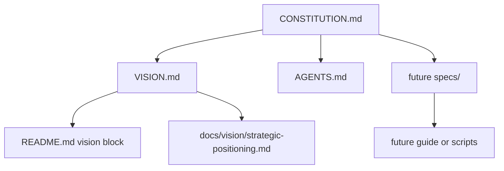

# Project Map

## Purpose And Scope

This map describes the repository as it exists today. The project is currently a documentation-first guide for terminal-first Windows 11 development, with governance artifacts and template community files.

This map does not define a future architecture, choose the default terminal stack, or specify setup behavior. Those decisions belong in future proposals, specs, and architecture docs when needed.

## System Overview

Observed facts:

- `CONSTITUTION.md` is the highest-priority governance artifact.
- `VISION.md` defines the project identity: a concise, auditable Windows 11 terminal-first development setup guide.
- `README.md` contains generated vision front-matter plus starter template content.
- `AGENTS.md` gives short operating rules for future agents.
- `docs/vision/strategic-positioning.md` records the rationale behind the initial vision.
- `.agents/skills/` contains workflow skill instructions used by agents; these are local process tools, not product source code.

Inference:

- The repository does not yet contain product implementation, setup scripts, source modules, generated configuration, or an application runtime.

## Repository Layout

- `README.md`: first-reader project overview. Its vision block is derived from `VISION.md`.
- `VISION.md`: canonical project identity, target audience, commitments, refusals, falsifiability, and open vision questions.
- `CONSTITUTION.md`: durable governance for specification, testing, architecture, security, compatibility, verification, review, documentation, and agent behavior.
- `AGENTS.md`: concise agent-facing operating guide that points to the constitution.
- `docs/vision/strategic-positioning.md`: supporting rationale for the initial vision.
- `CONTRIBUTING.md`: basic contribution expectations.
- `SECURITY.md`: vulnerability reporting placeholder with `<SECURITY_EMAIL>`.
- `CODE_OF_CONDUCT.md`: community conduct expectations with `<MAINTAINER_EMAIL>`.
- `LICENSE`: project license.
- `.gitignore`: local ignore rules.
- `.agents/skills/`: local agent workflow skills.

Directories not present today:

- `specs/`
- `docs/architecture/`
- `docs/changes/`
- `src/`, `app/`, `lib/`, or another source-code directory
- `tests/`
- `.github/workflows/`

## Runtime Flow

Observed facts:

- There is no runtime entry point.
- There are no setup scripts, CLIs, web apps, services, jobs, or generated commands in the product surface.

Inference:

- The current user flow is documentation consumption: a reader starts at `README.md`, follows the vision link to `VISION.md`, and future contributors follow `CONSTITUTION.md` and `AGENTS.md` before changing behavior.

## Data Flow

Observed facts:

- There are no data models, storage systems, schemas, migrations, serialized formats, or external data pipelines.
- The only generated relationship is conceptual: README vision front-matter is derived from `VISION.md`.

Inference:

- If future setup scripts create or edit files, those scripts will introduce data-flow boundaries that need specs and likely architecture notes under the constitution.

## External Boundaries

Observed facts:

- The product target is Windows 11 development setup.
- Current docs mention terminal workflow, shells, editors, package managers, security posture, Git, Windows Terminal, PowerShell, and WSL as compatibility surfaces or open choices.
- No third-party SDK, API, package manager dependency, or remote service is configured in the repository.

Inference:

- Future recommendations that affect package sources, credentials, execution policy, administrator settings, networking, WSL, Git, or shell configuration are security- and compatibility-sensitive boundaries.

## Test Map

Observed facts:

- No test directory or test framework exists.
- No Markdown lint, link check, script test, dry-run command, or fixture structure is configured.

Expected orientation from `CONSTITUTION.md`:

- Documentation-only changes need risk-appropriate checks such as link checks, Markdown linting, command review, or manual walkthrough evidence.
- Executable behavior needs tests, examples, dry-run checks, or another proof that can fail before implementation changes.

## CI And Release Map

Observed facts:

- There is no `.github/workflows/` directory.
- There are no package, build, release, or deployment configuration files.
- There are no established local validation commands.

Inference:

- Completion reports should state that no CI exists unless a change adds it.
- Future CI should start only when there are real commands to run, matching the README template guidance.

## Architecture Rules Observed

- Documentation-first is the current project shape.
- Governance artifacts are established before implementation artifacts.
- `CONSTITUTION.md` outranks all other project artifacts.
- `VISION.md` is the canonical project-vision artifact.
- README vision front-matter is generated from `VISION.md` and is not independently authoritative.
- Behavior-changing work is expected to move through specs, architecture, plans, tests or proof, review, and verification based on risk.
- Windows 11 is the primary compatibility target.

## Risk Areas

- The README still contains generic repository-template content beneath the vision block, which may confuse first-time readers until it is replaced with project-specific setup orientation.
- `SECURITY.md` and `CODE_OF_CONDUCT.md` still contain placeholder contact tokens.
- The default terminal stack is unresolved, so early setup guidance could drift between PowerShell-first, WSL-first, and side-by-side assumptions.
- No validation commands exist yet, so documentation quality and command correctness depend on manual review until checks are introduced.
- `.agents/skills/` is present in the repository; future contributors should know whether those process files are intentionally versioned project assets.

## Open Questions

- Should first-version guidance be PowerShell-first, WSL-first, or side-by-side?
- Should setup scripts exist in the first version, or should the project stay documentation-only until the guide stabilizes?
- Which package manager, editor, and shell assumptions are acceptable for initial documentation?
- What contact addresses should replace `<SECURITY_EMAIL>` and `<MAINTAINER_EMAIL>`?
- Should `.agents/skills/` remain committed as part of the project workflow, or be treated as local tooling?
